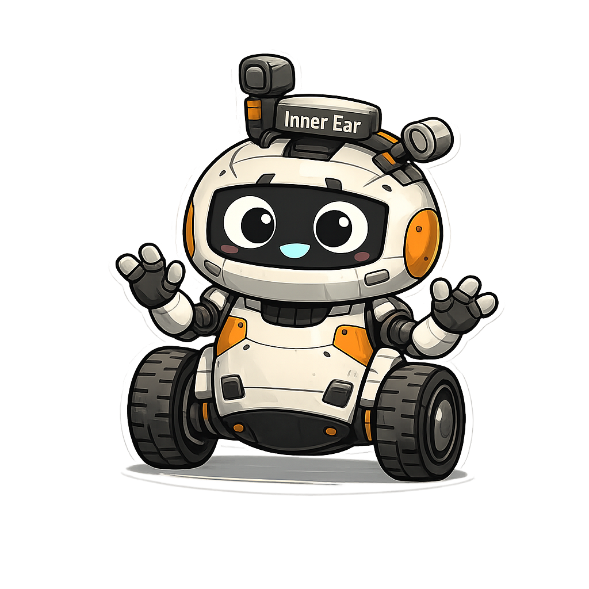

# Meet Gyra

## Meet Gyra - Our (un)Balancing Robot Mascot

Gyra is the official mascot of this control systems course. She is a small, two-wheel, self-balancing robot who is constantly fighting gravity. Gyra is not perfectly stable, not optimally tuned, and not afraid to fall over. Her purpose in the textbook is to turn abstract control concepts into a continuous narrative that gives students something tangible to care about.

Throughout the course, students take on the role of Gyra’s control engineers. Their mission is simple to state but challenging to achieve: help Gyra stay upright without wobbling, oscillating, or crashing too often.

Gyra represents every real-world control system that is just a little unstable until someone understands it well enough to design the right controller.

## Physical Description

Gyra is designed to look friendly, expressive, and slightly unstable.

* Height: Approximately knee-high to a human
* Body shape: Rounded, slightly top-heavy torso
* Center of mass: Intentionally high to make balancing difficult
* Wheels: Two moderately narrow wheels with visible motors
* Chassis: Exposed fasteners and panels that suggest frequent iteration and redesign
* Arms: Short, expressive arms that add personality but no physical stability

Gyra’s design makes it visually obvious why control is necessary. Without active feedback, she cannot remain upright for long.

## Sensors and Actuators

Gyra’s hardware is intentionally visible and named in human terms to reinforce intuition.

* Inertial Measurement Unit (IMU), which Gyra refers to as her “inner ear”
* Gyroscope, her “sense of spin”
* Accelerometers, which she describes as “listening to gravity”
* DC motors with limited torque and saturation
* Motor drivers with response delays and nonlinearities

These components are used throughout the textbook to motivate discussions of modeling assumptions, noise, delay, saturation, and real-world constraints.

## Personality

Gyra has a distinct personality that makes her relatable and memorable.

* Curious and eager to try new controller settings
* Optimistic, even after repeated falls
* Dramatic when oscillations grow too large
* Self-aware about her instability
* Honest about her limitations

Gyra never blames the student when she falls. Instead, she treats each failure as useful information about the system.

She frequently comments on her behavior in short narrative asides embedded in the text, helping students connect equations to physical outcomes.

## Role in the Textbook

Gyra serves multiple educational roles at once.

### Narrative Anchor

Each major topic in control systems is framed as a step forward in Gyra’s development. Students are not just learning theory; they are helping Gyra improve.

Examples include:

* Open-loop control as Gyra reacting too late
* Proportional control as Gyra becoming twitchy
* Integral action as Gyra accumulating past mistakes
* Derivative action as Gyra anticipating trouble
* Stability analysis as predicting whether Gyra will fall over eventually

### Concrete System Model

Gyra functions as a living system model.

* Her mass and geometry motivate system dynamics
* Her motors explain actuator limits
* Her delays motivate phase lag
* Her falls make instability consequences obvious

Instead of abstract plants and blocks, Gyra gives students a system they can imagine clearly.

### Safe Failure Mechanism

Gyra falls over often, especially early in the course. This is intentional.

Her failures reinforce the idea that:

* Instability is expected during design
* Tuning is iterative
* Trade-offs are unavoidable
* Perfect control does not exist

Students learn that falling over is not a mistake; it is data.

## Recurring Themes and Metaphors

Gyra introduces consistent metaphors that appear throughout the book.

* Overshoot is described as overreacting
* Oscillation is described as wobbling or panic
* Integral windup is described as holding onto past mistakes
* Damping is described as calming down
* Critical damping is described as feeling “just right”

These metaphors are repeated deliberately to build intuition alongside formal mathematics.

## Educational Philosophy

Gyra embodies the core philosophy of this course.

Control systems are not about memorizing equations. They are about understanding behavior, predicting outcomes, and making thoughtful design choices under constraints.

Gyra reminds students that every control system is ultimately trying to do something simple in a complicated world.

Stay upright
React in time
Do not overreact
Recover gracefully

If Gyra can do that, so can the students.

## Closing Note

Gyra is not perfect, and she never will be. Even at the end of the course, she still leans slightly forward, still hums quietly, and still needs feedback to stay upright.

That is what makes her a control system.

And that is why she belongs in this textbook.

Note that Gyra was inspired by the real-world [MIP Robot](https://wowwee.com/mip/)
