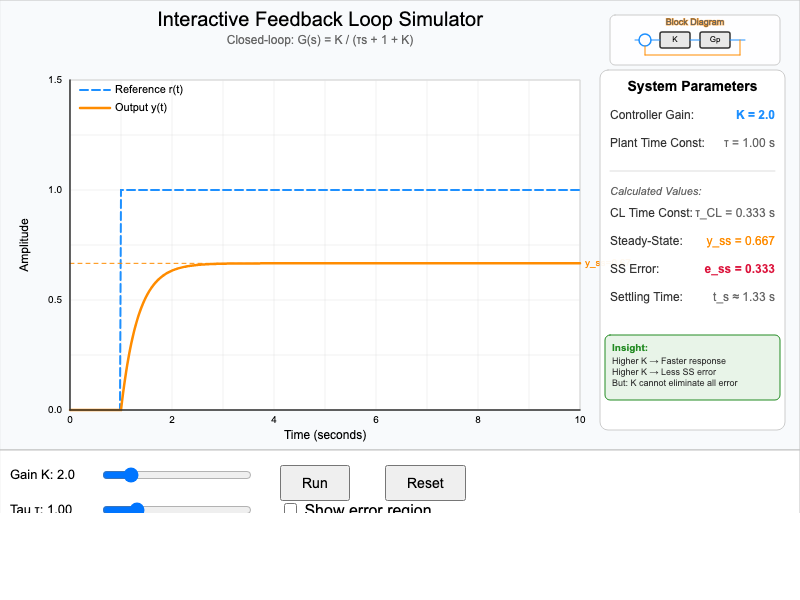
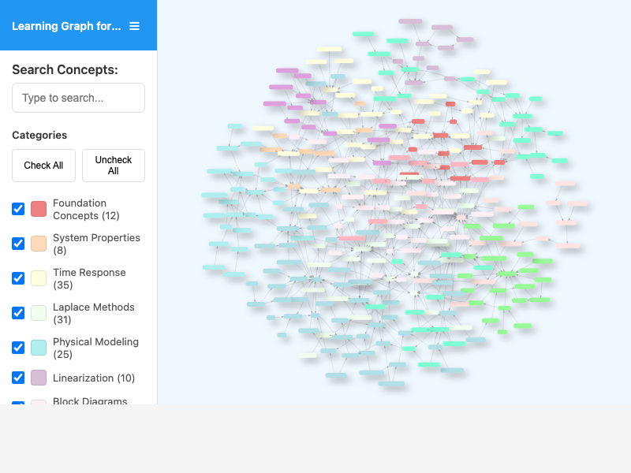

# List of MicroSims for Control Systems

Interactive Micro Simulations to help students learn control systems fundamentals.

-   **[Control System Examples](./control-system-examples/index.md)**

    

    Interactive infographic showing examples of open-loop and closed-loop control systems in everyday products and devices.

-   **[Feedback Loop Block Diagram](./feedback-loop-block-diagram/index.md)**

    

    Interactive block diagram showing signal flow through a closed-loop control system with hover descriptions for each component.

-   **[Feedback Loop Simulator](./feedback-loop-simulator/index.md)**

    

    Explore how controller gain K and plant time constant τ affect closed-loop step response, steady-state error, and settling time.

-   **[History of Control Systems](./timeline/index.md)**

    

    Interactive timeline spanning from ancient water clocks to AI-enhanced control, showing the evolution of control systems across three eras.

-   **[Learning Graph Viewer](./graph-viewer/index.md)**

    

    Interactive visualization of the control systems learning graph with search, filtering, and concept exploration features.

-   **[Open-Loop vs Closed-Loop Comparison](./open-vs-closed-loop/index.md)**

    

    Interactive side-by-side comparison demonstrating how feedback control enables superior disturbance rejection compared to open-loop systems.

